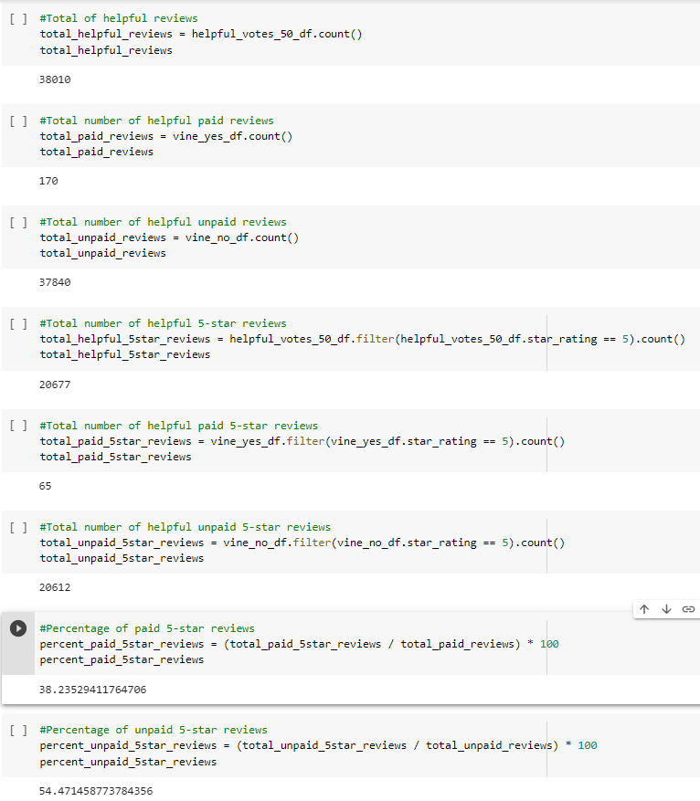
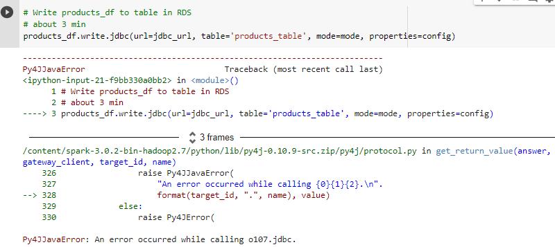
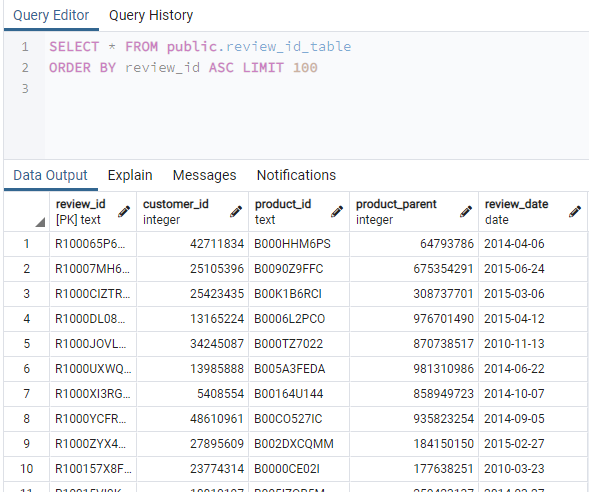
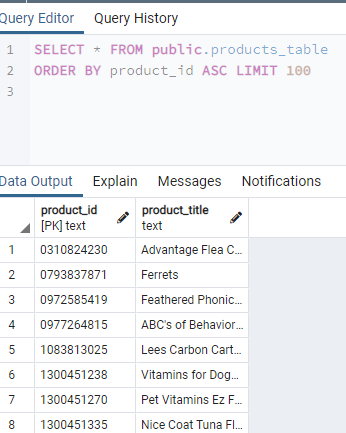
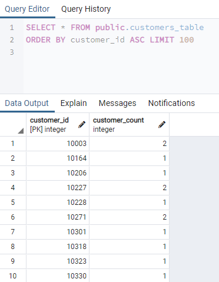
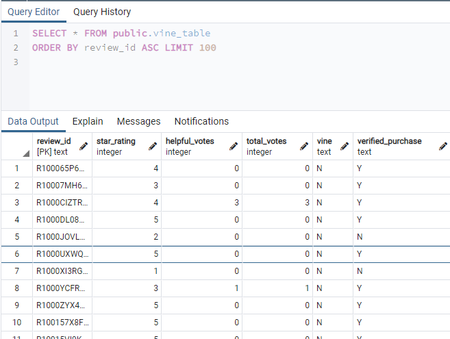

# Amazon Vine Reviews Analysis

## Overview and Purpose:

Using PySpark, the Amazon pet product reviews dataset was extracted and transformed for analysis.  A connection to an AWS RDS instance was then established to enable the transformed data to be loaded into pgAdmin tables.  PySpark was then utilized again to determine if there is any bias toward favorable reviews from Vine members.

## Analysis Results and Challenges:

### Analysis Results

Using PySpark, an analysis was performed on the Amazon pet products reviews dataset (containing 2,643,619 total reviews).  The dataset was initally filtered for reviews that obtained at least 20 votes.  For this analysis, 20 helpful votes is deemed the minimum criteria to focus the dataset.  This filtered dataset was then further filtered to only contain reviews where the number of helpful votes is at least 50% of the total votes for that review.  The resulting 38,010 reviews are analyzed to determine if there is any bias towards reviews that were written as part of the Vine program.   The following was found associated with the Vine reviews contained within the dataset:

1.  How many Vine reviews and non-Vine reviews were there?

For the 38,010 reviews in the dataset, 170 reviews were associated to the Vine program (paid review) while 37,840 reviews were not part of the Vine program (unpaid review).

2.  How many Vine reviews were 5-stars? How many non-Vine reviews were 5-stars?

Of the 170 Vine reviews, 65 were 5-star reviews.  And of the 37,840 unpaid, non-Vine reviews, 20,612 were 5-star reviews. 

3.  What percentage of Vine reviews were 5-stars? What percentage of non-Vine reviews were 5-stars?

Based on the total number of paid Vine reviews, 38.2% were 5-star reviws.  And based on the total number of unpaid, non-Vine reviews, 54.5% were 5-star reviews 

#### Vine Review Data Counts

### Challenges and Difficulties Encountered

For Deliverable 1, when loading the Customers dataframe data into the pgAdmin table, a Py4JJavaError was displayed in PySpark.  The other three tables in pgAdmin were loaded without PySpark error, and the Customers dataframe data successfully appeared in the Customers table in pgAdmin despite the error displayed.  To further try and determine the root cause for the error, the pgAdmin tables were dropped and reloaded through PySpark.  Again, the error appeared for only one of the four tables to be loaded (in this case the Review dataframe), but again, all four tables successfully populated in pgAdmin. The pgAdmin tables were dropped and reloaded for a third time after restarting the PySpark kernal, but again the error was observed for only one of the tables (in this case the Products dataframe). Reviewing feedback in Google, the error maybe related to the PySpark version, but because all pgAdmin tables were successfully loaded, it was advised by the instructional team to proceed with the analysis since the error did not prevent the data from being loaded into the pgAdmin tables and no adverse impact was observed.

Additionally for Deliverable 1, it was unclear from the Challenge directions if the vine_df dataframe should be used as the basis for further filtering.  Because the same result would occur, the original dataset was utilized to perform all additional filtering in order to review/reference additional columns beyond those included in vine_df dataframe.

See below for the PySpark error and the successful load into the pgAdmin tables.

#### PySpark error message

#### pgAdmin Review Table

#### pgAdmin Products Table

#### pgAdmin Customer Table

#### pgAdmin Vine Table

## Summary:

Based on the 5-star reviews percentage breakdown alone, there is no positivity bias for the Vine program reviews as there were only 38.2% 5-star reviews associated with paid Vine reviews but 54.5% 5-star reviews associated with unpaid, non-Vine reviews.  The number of unpaid reviews compared to paid reviews (significantly larger population size) supports that the percentage breakdown is a reliable indicator and not inappropriately skewed from the smaller total number of paid reviews.

Additional analysis can be performed using Natural language processing (NLP) to perform sentiment analysis on the Vine reviews.  This would provide more insight into the sentiment associated with the product reviews to determine if the Vine program contributes to any bias toward favorable reviews from Vine members or if the Vine reviews are sincere and honest 5-star reviews regardless of payment. Associating the 5-star reviews to particular products and then breaking down paid vs. unpaid reviews for each product would also provide evidence on if there was favorable review bias for Vine members or a general customer 5-star satisfaction with the product regardless if the review was paid or unpaid.
